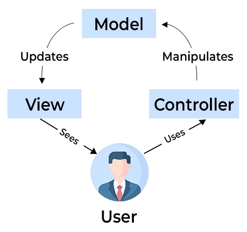

# myfinance-web-netcore

# Sobre o MyFinance Web
O MyFinance Web é uma plataforma inovadora projetada para proporcionar uma gestão financeira eficiente de receitas e despesas. Com um foco central em facilitar o controle de entradas e saídas, esta aplicação oferece uma experiência intuitiva e prática para organizar suas finanças pessoais de maneira eficaz.

## Origem do Projeto
O MyFinance Web foi concebido como parte do trabalho prático da disciplina "Práticas de Implementação e Evolução de Software" no curso de pós-graduação em Engenharia de Software da PUC Minas. Através de um processo de desenvolvimento rigoroso e atento aos padrões da indústria, a plataforma se tornou uma solução hipotética completa para controle de finanças pessoais.

## Objetivo

Nosso principal objetivo é oferecer aos usuários uma ferramenta acessível, poderosa e segura para gerenciamento financeiro. Com o MyFinance Web, buscamos simplificar a vida financeira das pessoas, permitindo que tomem decisões mais conscientes e alcancem uma maior estabilidade econômica.

## Integrantes

- <a href="https://github.com/ClauAlmeida">Claudia Cristina Ribeiro de Almeida</a>
- <a href="https://github.com/alvesguilherme7">Guilherme Henrique Silva Alves</a>
- <a href="https://github.com/LucasCVilasBoas">Lucas Cerqueira Vilas Boas</a>


## Funcionalidades do MyFinance Web

- Gerenciamento de Contas: Adicione, edite ou remova contas facilmente, permitindo um controle completo sobre suas fontes de receitas e despesas.

- Registro de Transações: Acompanhe suas transações financeiras de forma detalhada, garantindo que cada movimentação seja devidamente documentada e categorizada.


## Padrão de Arquitetura

O projeto utiliza o padrão de arquitetura MVC, que separa a aplicação em três camadas (Model - View - Controller).

Model: camada responsável por gerenciar e controlar a forma como os dados se comportam por meio das funções e regras de negócios estabelecidas. 

View: camada responsável por apresentar as informações ao usuário, através de uma interface gráfica.

Controller: camada responsável por intermediar as requisições enviadas pelo View com as respostas fornecidas pelo Model.




#  Como Executar o Projeto
Este documento descreve os passos necessários para executar o projeto MyFinance em seu ambiente local. O projeto é baseado na plataforma .NET e utiliza um banco de dados Microsoft SQL Server.

## Pré-requisitos

* <a href="https://code.visualstudio.com">Visual Studio Code</a>

* <a href="https://dotnet.microsoft.com/en-us/download">.NET Core SDK 6.0</a>

* <a href="https://git-scm.com/downloads">Git</a>

* <a href="https://marketplace.visualstudio.com/items?itemName=ms-dotnettools.csharp">Extensão C# para Visual Studio</a>

* <a href="https://www.microsoft.com/pt-br/sql-server/sql-server-downloads">Microsoft SQL Server 2022</a>

## Passos para Executar o Projeto

1. Abra o terminal ou prompt de comando e execute o seguinte comando para clonar o repositório do projeto:

```bash
git clone https://github.com/alvesguilherme7/myfinance-web-netcore
```

2. **Configurar o Banco de Dados**

Antes de executar o projeto, é necessário configurar o banco de dados. Para isso, siga os passos a seguir:

- Abra o Microsoft SQL Server Management Studio (SSMS).
- Na barra de menus, clique em "Arquivo" e, em seguida, "Abrir" > "Arquivo".
- Crie o banco de dados myfinance
- Navegue até a pasta do projeto e selecione o arquivo "script-banco.sql" e clique em "Abrir".
- Com o script aberto no SSMS, clique no botão "Executar" ou pressione F5 para criar o banco de dados e as tabelas necessárias.


3. **Adicionar bibliotecas ao projeto**

- Inclua a biblioteca do mySQL no .NET, usando o seguinte comando:

```bash
dotnet add package Pomelo.EntityFrameworkCore.MySqlld
```

- Inclua a biblioteca do Entity no .NET, usando o seguinte comando:

```bash
dotnet add package microsoft.entityframeworkcore.mysql
```

4. **Executar o Build do Projeto**

Agora, é hora de compilar o projeto. No terminal ou prompt de comando, execute o seguinte comando:

```bash
dotnet build
```

Este comando irá restaurar as dependências e compilar o projeto.

5. **Executar o Projeto**

Após o build ser concluído com sucesso, execute o projeto com o seguinte comando:

```bash
dotnet run
```

Aguarde até que o projeto seja iniciado e você verá informações no console indicando que o servidor está em execução.

6. **Acessar o Projeto**

Abra um navegador da web e acesse a URL e porta indicadas no console após a execução do projeto. 

Agora você deve estar com o projeto "MyFinance" em execução em seu ambiente local. Divirta-se explorando-o!


## Contribuições
Este projeto é de código aberto e aceita contribuições da comunidade de desenvolvedores interessados em aprimorar o controle financeiro das pessoas. Se você tem ideias, sugestões ou identificou possíveis melhorias, fique à vontade para contribuir em nosso repositório no GitHub.